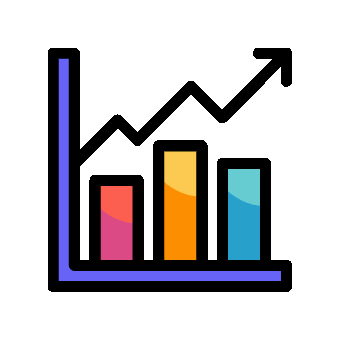

<!-- Animação de ondas Gray

 

-->

<!-- Essa era a animação de letras aparecendo

 
 
 -->

 

    
 

#  &nbsp; Welcome to my Readme &nbsp; 

### Work with optimism and hope for the best!

👋 Greetings! It's great to have you here. I'm Filipe Magalhães, an enthusiastic Software Engineering student from Brazil. .

🎓 I am studying for my degree in **Software Engineering** at Estácio University.

🔥 I document my technology learnings on **GitHub and Notion** with screenshots for easy comprehension, creating a resource that also helps others in the field.

💡 Motivated by real-world challenges, I am always exploring how technology can solve practical problems, generating solutions that bridge the gap between ideas and impactful results.

🤩 I intend to build a career with committed and dedicated people who will help me explore myself and understand my potential. Willing to work as a key player in a challenging and creative environment with all my professional and technical skills.

 

# Projects 

  ### FRONT-END
  

    
Click to expand

    

      
      
      
      
      
      
      
      
      
      
      
      
    

  

 
 

# Certifications 

📄 Below is a demonstration of my knowledge and skills across a wide range of web technology related content.

 

| S.No. | Certificate Name | Issuing Authority | Date | Credential |
|:-----:|:-----------------:|:------------------:|:----:|:----------:|
| 1. | web development | Curso em Vídeo | February 2024 | [View](https://lydian-enthusiasm-040.notion.site/Curso-em-V-deo-571e930a044240b1bdc8556408be9671?pvs=4) |
| 2. | HTML | MIMO | March 2025 | [View](https://github.com/filipecode-03/MIMO) |
| 3. | Responsive Web Design | freeCodeCamp | March 2025 | [View](https://github.com/filipecode-03/freeCodeCamp) |
| 4. | HTML, CSS, JS | W3Schools | March 2025 | [View](https://github.com/filipecode-03/W3Schools) |

 

# Tech Stack 

<samp>Tools & Technologies</samp> | <samp>Badge</samp> |
--- | --- |
<samp>Web development</samp> |                 |
<samp>Operating System</samp> |    |
<samp>Programming Languages</samp> |      |
<samp>IDE & tools</samp> |      |
<samp>Version Control</samp> |   |
<samp>Servers</samp> | |
<samp>Databases</samp> |  

 

# My GitHub Insights & Stats 

  
   
  

  

<!-- animação de onda gray

 

-->
